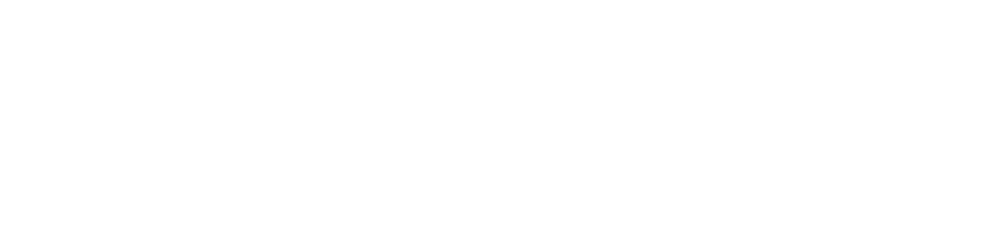
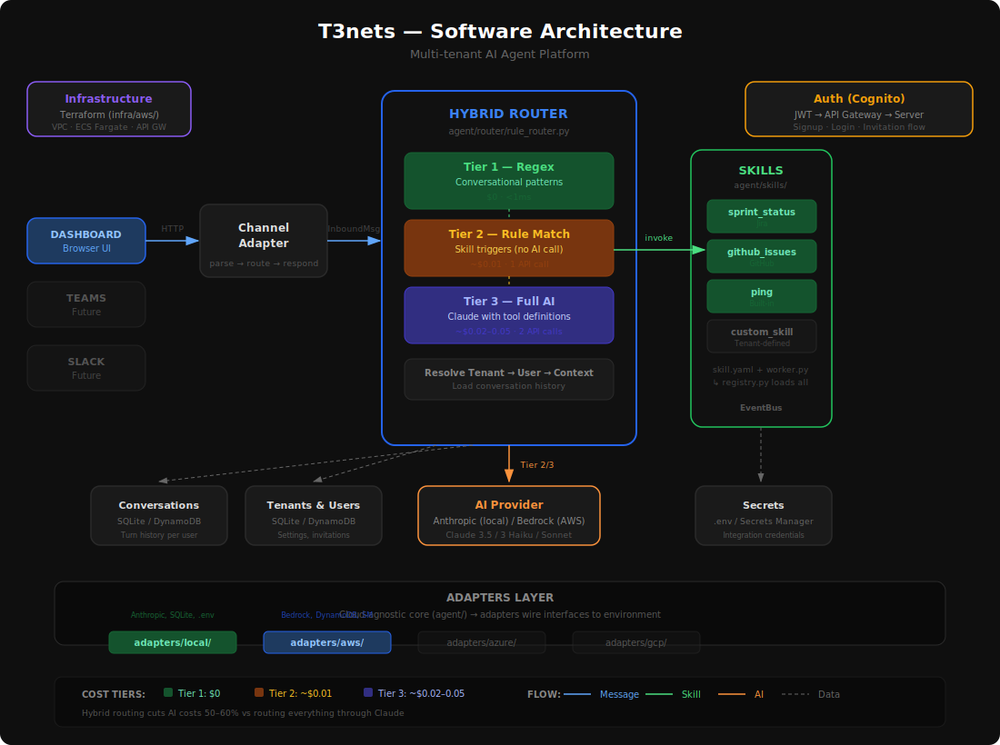

<p align="center">
  <picture>
    <source media="(prefers-color-scheme: dark)" srcset="docs/logo-dark.png" />
    <source media="(prefers-color-scheme: light)" srcset="docs/logo-light.png" />
    
  </picture>
</p>

<p align="center">
  <strong>Open-source, multi-tenant AI agent platform for teams.</strong><br/>
  Connect your tools. Talk through your channels. Cut AI costs by 60%.
</p>

<p align="center">
  <a href="LICENSE"></a>
  <a href="https://www.python.org/"></a>
  <a href="docs/aws-infrastructure.md"></a>
</p>

---

T3nets is the layer between your team's communication channels and their productivity tools. Instead of switching between Jira, GitHub, email, and calendars — you ask a question and get an answer.

A **hybrid routing engine** handles the heavy lifting: known requests are matched locally for $0, while complex queries are routed to Claude AI with full tool access. The result is an AI agent platform that's smart when it needs to be and free when it doesn't.

```
You (Dashboard / Teams / Telegram) → T3nets → Claude AI → Your Tools → Answer
```

### See it in action

> **You:** What's the sprint status?
>
> **T3nets:** 🏃 **NOVA S12E4** — "Finish Lynx"
> 41% done, 5 days left. 2 blocked items. Risk: **HIGH**.
> Suggestion: Descope the test tickets and focus on getting blocked items through.

---

## Why T3nets

| | |
|---|---|
| **Cut AI costs 50-60%** | Hybrid routing handles known requests at $0 via regex, only escalating to Claude when needed |
| **Multi-tenant from day one** | Shared compute, isolated data. Cognito auth, JWT, tenant onboarding wizard |
| **Cloud-agnostic core** | Business logic has zero cloud imports. Pluggable adapters for AWS, Azure, GCP |
| **Skills, not code** | Add capabilities with a `skill.yaml` + `worker.py` — no router changes needed |
| **Practices** *(coming soon)* | Team experience bundles: skills + custom pages + functionality, uploadable as ZIPs |
| **Any channel** | Dashboard, Teams, Telegram today. Slack, WhatsApp, SMS on the roadmap |

---

## Architecture

<p align="center">
  
</p>

### Three-Tier Hybrid Routing

The routing engine is the core differentiator. Every inbound message cascades through three cost tiers:

| Tier | Method | Cost | Latency | Example |
|------|--------|------|---------|---------|
| **1** | Regex pattern matching | **$0** | <1ms | "hi", "thanks", "help" |
| **2** | Rule-matched skill trigger | **~$0.01** | 1 API call | "sprint status", "create a ticket" |
| **3** | Full Claude AI with tools | **~$0.02-0.05** | 2 API calls | "summarize what changed this week and flag risks" |

Most team traffic hits Tier 1 and 2. Claude only fires when it's genuinely needed.

---

## Quick Start

```bash
git clone https://github.com/WildEllie/t3nets.git
cd t3nets

python3 -m venv venv && source venv/bin/activate
pip install -e ".[local,dev]"

cp .env.example .env        # Add your Anthropic API key
python -m adapters.local.dev_server
```

Open **http://localhost:8080** — you're chatting with your agent.

Or with Docker:

```bash
docker compose up
```

---

## Deploy on AWS

Production-grade Terraform infrastructure: VPC, ECS Fargate, API Gateway, DynamoDB, Bedrock, Secrets Manager.

```bash
cd infra/aws
terraform init && terraform apply -var-file=environments/dev.tfvars

# Seed data and deploy container
./scripts/seed.sh
./scripts/deploy.sh
```

See [AWS Infrastructure Guide](docs/aws-infrastructure.md) for full deployment details.

---

## Extend

### Add a Skill

A skill is a directory with two files:

```yaml
# agent/skills/my_skill/skill.yaml
name: my_skill
description: What this skill does
requires_integration: some_service
parameters:
  type: object
  properties:
    action:
      type: string
```

```python
# agent/skills/my_skill/worker.py
def execute(params: dict, secrets: dict) -> dict:
    return {"result": "..."}
```

The router picks it up automatically. See [sprint_status](agent/skills/sprint_status/) for a working example.

### Add a Channel

Implement `ChannelAdapter` — 5 methods. See [agent/channels/](agent/channels/).

### Add a Cloud Provider

Implement 5 interfaces: `AIProvider`, `ConversationStore`, `EventBus`, `SecretsProvider`, `BlobStore`. See [adapters/](adapters/) for the local and AWS implementations.

---

## Project Structure

```
t3nets/
├── agent/                    # Cloud-agnostic core (zero cloud imports)
│   ├── router/               # Hybrid routing engine (3-tier)
│   ├── skills/               # Skill definitions + workers
│   ├── channels/             # Channel adapters (dashboard, Teams, Telegram)
│   ├── memory/               # Conversation history management
│   ├── interfaces/           # Abstract contracts
│   └── models/               # Shared data models
├── adapters/                 # Cloud-specific implementations
│   ├── local/                # Anthropic API, SQLite, .env, dev server + UI
│   └── aws/                  # Bedrock, DynamoDB, Secrets Manager, ECS server
├── infra/aws/                # Terraform modules
├── scripts/                  # Deploy & seed scripts
└── docs/                     # Architecture docs, decision log, roadmap
```

---

## Roadmap

| Phase | Status | Description |
|-------|--------|-------------|
| 0 | Done | Design, prototype, hybrid routing, dev server |
| 1 | Done | AWS infrastructure — Terraform, Bedrock, DynamoDB |
| 1b | Done | Deploy to AWS, settings page, AI model registry |
| 2 | Done | Multi-tenancy — Cognito auth, tenant isolation, onboarding wizard |
| 2b | Done | Tenant management — skill toggles, integration config from dashboard |
| 3 | Done | External channels — Teams, Telegram adapters |
| 3b | Done | Async skills — EventBridge + Lambda + SQS + WebSocket |
| 4 | Done | Invitation flow — link-based invites, join page, team management |
| 4.5 | Done | Session management — silent refresh, idle expiry, role-based access |
| 4.6 | Done | Platform admin — tenant lifecycle (create, suspend, delete) |
| 5 | Planned | AI-Generated Rule Engine — AI creates per-tenant regex from skill metadata |
| 6 | Planned | Expand skills — GitHub Issues, Google Calendar, Email triage |
| 7 | Planned | Email delivery — SES invitations, tenant branding |
| 8 | Planned | Practices — team experience bundles (skills + pages as uploadable ZIPs) |
| 9 | Planned | Dashboard & UX — SPA, dark mode, mobile responsive |
| 10 | Planned | Long-term memory, more channels, public release |

Full roadmap: [docs/ROADMAP.md](docs/ROADMAP.md)

---

## Documentation

| Guide | Description |
|-------|-------------|
| [Local Development](docs/local-development.md) | Quick start, dev server, local adapters |
| [AWS Infrastructure](docs/aws-infrastructure.md) | Terraform, deployment, Bedrock, DynamoDB |
| [Hybrid Routing](docs/hybrid-routing.md) | Three-tier routing engine, cost analysis |
| [AI Models & Pricing](docs/ai-models-pricing.md) | Model options and tiered strategy |
| [DynamoDB Schema](docs/dynamodb-schema.md) | Table design, key patterns |
| [Decision Log](docs/decision-log.md) | Architecture Decision Records (13 ADRs) |
| [Roadmap](docs/ROADMAP.md) | Phases, backlog, what's next |

---

## Contributing

Contributions welcome. Open an issue to discuss what you'd like to change, or submit a PR.

## License

[MIT](LICENSE)
